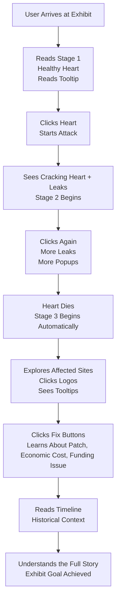

# Virtual Exhibit Case Proposal - Group 1

**Section:** S03
**Category:** Problem Solving Stories

## Heartbleed: When the Internet’s Heart Started Bleeding Secrets

---

## Group Member Roster
- Gutang, Neil Jr. Langgamon
- Quijano, Myrvin Umapas
- Tan, Roberta Netanya
- Tolentino, Winelle Roxas 
- Wong, Allisha Kate Ubani

---

## **Topic Theme: The Heartbleed Bug (2014)**

Heartbleed is one of the most devastating security vulnerabilities in Internet history. Disclosed on April 7, 2014, it exploited a missing bounds check in OpenSSL's implementation of the TLS heartbeat extension. By sending a malformed heartbeat request with a mismatched payload length, an attacker could trick a vulnerable server into returning up to 64KB of its own process memory per request - including private keys, session tokens, and plaintext credentials - with no trace in server logs. This exhibit tells the full story: from the architectural flaw in OpenSSL's buffer handling, to the frantic global patch effort, to the long tail of unpatched servers that remained vulnerable for years. Heartbleed is a canonical case study in how a single missing line of validation code can compromise the internet's encrypted backbone.

---

## Exhibit Concept & Narrative Discussion

**The virtual exhibit will guide users through three core concepts:** 

1. **The Architecture of a Flaw (Memory Management):** We will explore low-level memory allocation in C. The exhibit will break down the specific memory copy function call that caused the bug, explaining the concept of buffer over-reads and dynamic memory allocation. To make this highly engaging, we will implement an interactive MDX code snippet allowing users to toggle between the actual historical "Vulnerable Code" and the "Patched Code," showing exactly where the missing bounds-check was finally added.  
2. **Network Packet Anatomy:** The exhibit will visualize the invisible network layer by comparing standard vs. malicious TLS heartbeat packets. To provide an authentic vulnerability assessment experience, we will display real Wireshark packet captures of a Heartbleed payload instead of simulated text. By examining these realistic hex dumps, users will see exactly how the vulnerability tricked the server logic by manipulating the "Payload Length" variable.  
3. **The Open-Source Paradox:** This section provides a sociological and economic breather from the technical data by exploring the human element of the bug. It will be structured as a dramatic narrative: covering the well-meaning flawed code commit in 2011, the two years it sat unnoticed while OpenSSL secured the web, the frantic simultaneous discovery by security researchers, and the ultimate resolution where the tech industry formed the Core Infrastructure Initiative to finally fund the open-source projects they relied upon.

## **Group’s Tech Stack Plan:**

* **Runtime & Framework:** Node.js 26 and Astro 6\. This ensures compatibility when all repositories are merged into the central museum website.  
* **UI/Components:**  
  * React (.jsx or .tsx) will be used to build interactive simulations embedded in .mdx content pages.  
  * Three.js (via React Three Fiber) will be utilized to render the interactive 3D wireframe globe for the Stage 3 climax on desktop viewports.
  * Tailwind CSS for utility-first styling, scoped to the exhibit's visual theme while remaining compatible with the central museum template.  
* **Version Control:** All incremental plans, source code, and documentation will be hosted on GitHub. Team members will manage local Git credential configurations to ensure accurate commit histories prior to the final merge.

## **Proposed Interactive Element**

**The Heartbleed Hemorrhage Simu lation**

This simulation teaches the Heartbleed vulnerability through a three-stage interactive experience, implemented as a React component (HeartbleedSimulation.jsx) embedded in the MDX content page.

**Stage 1 \- Healthy Server Heart**

A pulsing wireframe heart rendered in crimson is displayed to the user, representing an OpenSSL server operating normally. The heart pulses rhythmically to simulate a live TLS heartbeat exchange. A brief contextual tooltip explains what the heartbeat extension is and its intended purpose: a lightweight keep-alive ping between client and server.

* Visual: Animated wireframe heart (CSS/SVG), pulsing at \~1 Hz  
* User state: Passive observation; a "Send Heartbeat Request" button becomes available  
* Educational goal: Establish what normal looks like before the exploit is introduced

**Stage 2 \- The Attack: Memory Bleeds Out**

The user clicks the heart to simulate sending a malformed heartbeat request — one that claims a payload of 64KB but actually sends only a few bytes. With each click, the heart visually cracks and shrinks, losing health. Binary data and memory fragments bleed out from the crack, simulating the server returning memory it should not have. Pop-up info cards appear progressively, revealing context about the exploit mechanics.

* Visual: Shrink animation, dripping binary particles, progressive info card reveals  
  * Realistic hex dumps and string extractions mirroring what an analyst would see during a vulnerability assessment or in a Wireshark packet capture. It will display mocked leaked memory bytes alongside decoded ASCII text (e.g., 0x0040: ... S E S S I O N \_ I D \= ..., private key fragments, and plaintext credentials)
    * More random popup windows alongside the leaked memory windows would serve to display tiny details that could showcase the timeline of events  
* User interaction: Click to send malformed requests  
* Educational goal: Allow the user to simplify and visualize the severity of the memory leaks that occurred through the stylized popup windows.

**Stage 3 \- The Aftermath: A Bleeding World**

Once the heart's health reaches zero, it shrinks significantly smaller, changes color, and rises to the top of the viewport. The background transitions to a visual showing affected services going offline one by one, each with a tooltip showing a real affected service (Yahoo, LastPass, OKCupid, etc.). Interactive buttons allow users to explore recovery methods, affected systems, the human cost, and the OpenSSL underfunding problem Heartbleed exposed.

* Visual: Globe wireframe, cascading node failures, floating action buttons  
* User interaction: Click nodes and buttons for supplementary information  
* Educational goal: Contextualize the global scale and transition from technical exploit to real-world consequences

### **Mobile-Responsive Layout**

The exhibit will feature a single-column stacked layout on mobile devices (breakpoint: \< 768px):

* The interactive simulation is prioritized at the top with touch-friendly tap targets (minimum 44×44px hitboxes) replacing click interactions  
* Stage 2 info cards collapse into a swipeable carousel on mobile to prevent overflow  
* Stage 3 globe scales down to a flat SVG world map on mobile to avoid Three.js performance issues on lower-end devices  
* MDX educational content flows below the simulation in a readable single column  
* All font sizes scale via clamp() for readability across viewport sizes

### 

### **Tentative Style Guide Snapshot**

**[Mock Up Design](https://canva.link/virtual-exhib-grp1-csarch2)**

**Aesthetic Direction**

* Dark and synthwave-inspired. Will lean into the [Heartbleed](https://www.heartbleed.com/) brand but with a twist: it utilizes vibrant, high-contrast colors (bright pinks, purples, and cyans) against a dark background. This creates a stylized "cyberpunk forensic" aesthetic that makes the vulnerability feel visually striking and urgent. Typography uses a monospace technical font to ground the neon visuals in raw system architecture.

**Component Library**

* shadcn/ui

**Typography**

* JetBrains Mono  
* Space Grotesk
---

## User Journey Flowchart

