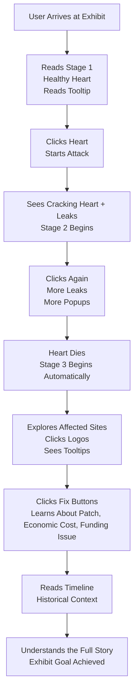

# Virtual Exhibit - Incremental Progress Report · Group 1

**Section:** S03 | **Group:** 1 | **Exhibit:** HEARTBLEED (CVE-2014-0160)
**Deployed site:** [https://2ru17.github.io/virtual-exhibit-proj-2026-g1/](https://2ru17.github.io/virtual-exhibit-proj-2026-g1/)

---

## What We Built Since the Last Submission

Since the initial exhibit proposal, the group progressed from a static mockup concept into a **fully deployed, interactive multi-stage simulation** with a custom visual identity. The major additions are:

- **Three-stage interactive simulation** - Stage 1 (healthy heartbeat demo), Stage 2 (click-to-attack with binary drip and draggable memory-leak popups), Stage 3 (Three.js 3D rotating globe with clickable breach markers).
- **Custom SVG wireframe heart** - built entirely from parametric math (no external SVG library) using the classic heart curve equations, with meridian and parallel wireframe lines for a 3D look.
- **Dark cyberpunk theme** - scoped Tailwind v4 design system (`heartbleed-theme.css`) with six exhibit-specific color tokens, seven custom CSS keyframe animations, and custom typography (JetBrains Mono + Space Grotesk).
- **10 chapter components** - each exhibit section is a self-contained React component with its own styled card layout, keeping the MDX page readable.
- **Historical timeline** - themed event cards with date, event title, significance badge, and animated hover states.
- **File structure refactored for museum merge** - all Group 1 files consolidated into `src/S03_Group1_heartbleed/` per the `Task-todo.txt` naming convention.

---

## Aha Moments

### Architecture reveals itself through implementation
Writing `heartMath.js` was the clearest aha moment of the project. The Heartbleed bug is fundamentally about trusting a declared length over the actual data - and we realized our own heart-rendering code had to do the same kind of bounds reasoning: generate the correct number of sample points, don't over-read, don't under-draw. The geometry became a metaphor for the bug itself.

### Astro's island architecture matches the exhibit's narrative structure
We initially thought of Astro as "just a static site builder," but the `client:load` island model turned out to perfectly mirror the exhibit's staged reveal. Each chapter section is inert HTML until the user scrolls to it and the simulation activates - the same way the Heartbleed bug was inert in the codebase until a specific code path was triggered.

### Raw Three.js vs. an abstraction layer
The proposal mentioned React Three Fiber, but we opted for raw Three.js imperatively inside a `useEffect`. The aha moment was realizing that the animation loop, marker projection, and ResizeObserver all need tight control that imperative code gives cleanly - the abstraction would have cost more than it saved here.

### Scope compression is a design skill
The original proposal described Wireshark hex dumps and realistic packet captures as exhibit content. When we scoped down to the actual implementation, we realized the *feeling* of leaked memory - typewriter text, dripping binary, draggable popup "memory windows" - was far more effective educationally than literal hex data. Simplification made the interaction clearer, not weaker.

### Working around immutable layout files
We were constrained by a rule not to modify the global `ExhibitLayout.astro` file, which was originally squishing our content into a narrow center column. The aha moment was realizing we could use our isolated `heartbleed-theme.css` to globally override `.content__block` and `.padder` using `!important` specifically for our exhibit, effectively hacking the museum's walls to give our exhibit more floor space without breaking the rules.

### React State as a Narrative Tool
Initially, we viewed React simply as a way to render the UI components. However, mapping the stages of the Heartbleed vulnerability (Healthy, Under Attack, Aftermath) directly to React state variables allowed us to build the narrative as an interactive state machine. The realization was that component state doesn't just manage data-it drives the educational pacing of the exhibit.

### Resolving conflicts through Git strategy
When we refactored the file structure to move everything into the `S03_Group1_heartbleed` folder, it created significant merge conflicts. The aha moment was realizing that by using the command line to selectively accept `HEAD` changes for the MDX file and issuing `git rm` for the old deleted component paths, we could cleanly resolve structural conflicts without losing any content or layout progress.

### Styling raw Markdown through CSS pseudo-classes
We wanted to give each chapter heading its own unique story-driven animation (e.g., glitching, alarms). Since we couldn't edit the raw HTML tags inside the MDX file without breaking the global layout's Table of Contents, our aha moment was using CSS `:nth-of-type()` selectors to target specific `<h2>` elements sequentially down the page.

---

## Things Learned

| Area | What We Learned |
|---|---|
| **Tailwind v4** | `@theme` blocks replace `tailwind.config.js`; the plugin is a Vite plugin, not a PostCSS plugin. Custom color tokens defined in `@theme` are automatically available as utilities (e.g., `text-hb-primary`). |
| **Astro MDX** | Frontmatter `layout:` wires up the page layout; CSS imported from MDX is scoped to that page's build chunk. Component islands use `client:load` to opt into hydration. |
| **Parametric math** | The heart curve `x = 16sin³(t), y = 13cos(t) − 5cos(2t) − 2cos(3t) − cos(4t)` and how to derive meridian + parallel lines from it to simulate a 3D wireframe surface. |
| **Three.js lifecycle** | Proper cleanup in React: cancel animation frame, disconnect ResizeObserver, dispose geometries, materials, and renderer. Missing any of these causes memory leaks with Astro's partial hydration. |
| **Pointer events for drag** | `pointerdown/pointermove/pointerup` on `window` (not the element) handles fast mouse moves without losing tracking. Touch + mouse parity is automatic. |
| **Merge hygiene** | Naming conventions like `S03_Group1_heartbleed/` matter enormously when multiple teams push into the same repository. Planning imports around a namespaced folder prevents all merge conflicts at the file level. |
| **CSS Scoping vs Plain CSS** | Astro's `:global()` pseudo-class only works inside Astro `<style>` blocks. Using it inside a standard `.css` file causes the browser to silently drop the entire CSS rule as invalid. |
| **Animation Performance** | Triggering reflows via CSS `width` or `margin` in animations causes layout thrashing. Moving to `transform: translate()` and `opacity` for our scroll-reveal animations kept the framerate locked at 60fps. |
| **Git Merge Conflict Resolution** | How to handle structural merge conflicts (modify/delete conflicts) when files are moved to namespaced folders, using `git rm` and selectively accepting HEAD changes. |
| **CSS Pseudo-classes for Narrative** | Using `:nth-of-type()` in a scoped stylesheet to apply unique storytelling animations (pulse, glitch, strobe) to sequential Markdown headings without modifying the underlying HTML. |

---

## Challenges Faced

### Getting Three.js to play nicely with Astro's SSR
Three.js references `window` and `document` at import time, which crashes Astro's server-side render. The fix was to make the globe component React-only with `client:load` and keep all Three.js code inside a `useEffect` that only runs in the browser. Finding this took significant debugging.

### Tailwind v4 with no PostCSS
Almost all Tailwind documentation online targets v3. Tailwind v4 uses a Vite plugin (`@tailwindcss/vite`) and an `@import "tailwindcss"` directive instead of PostCSS directives. Many setup tutorials were wrong for our version and caused silent failures before we identified the issue.

### Keeping the dark theme scoped to our exhibit
`global.css` is marked DO NOT MODIFY by the instructor and uses a light theme. We needed our dark cyberpunk theme to apply to our exhibit only. The solution was importing `heartbleed-theme.css` exclusively inside `heartbleed.mdx` - Astro's CSS chunking ensures it only loads on that page.

### Popup positioning going off-screen
Draggable popups in Stage 2 and 3 are spawned at computed cascade positions. On narrower viewports, higher-index popups spawn outside the visible area. We identified this as a known issue but have not yet implemented viewport clamping - the fix involves reading `containerRef.current.getBoundingClientRect()` on spawn and clamping `x` and `y` accordingly. Additional modifications were made to have the popups relatively appear more random via adding minimum values for randomizing positioning constants.

### Marker overlap on the Three.js globe
Several markers in Stage 3 shared the same latitude (`theta` and `phi`) values, causing HTML labels like "Codenomicon" and "Imgur" to stack directly on top of each other. We resolved this by manually tweaking the spherical coordinates for each marker so they spread out visually across the globe's curvature.

### Managing overlapping absolute animations
In Stage 2, our dripping binary animation was falling directly onto our typewriter text. Because both were absolutely positioned inside a relative flex box, traditional margin pushing didn't work. We had to explicitly manage the container's height and the vertical padding of the text block to give the binary a proper "fall distance" before hitting the text.

### Code Block Wrapping
Handling the long strings of mocked server code and payload data proved frustrating because CSS `break-all` was chopping words in half. We had to carefully balance `whitespace-pre-wrap` with `break-words` and adequate padding to ensure the code snippets looked clean and readable without triggering horizontal scrolling.

### Managing structural merge conflicts
Because we moved all of our components and styles from the global `src/components/` directory into a namespaced `src/S03_Group1_heartbleed/` folder, attempting to merge the branches resulted in multiple "modify/delete" conflicts. Resolving this required careful command-line Git intervention to ensure the old files were fully removed while preserving the updated component imports in the MDX file.

---

## Creative Development Notes

The visual direction evolved from "dark hacker aesthetic" to something more specific: **cyberpunk forensics**. The goal was to make the vulnerability feel simultaneously technical and emotional - like reading a post-mortem report under neon lighting. Key creative decisions:

- **Hot pink (`#ff279e`) as the primary accent** - chosen because Heartbleed's own official logo uses red/pink, and the color reads as "alarm" without being literal red.
- **Heart as the central metaphor** - both literally (TLS heartbeat extension) and emotionally (something vital bleeding out). The wireframe treatment keeps it technical rather than sentimental.
- **Draggable popup windows as "leaked memory"** - the interaction of clicking the heart and watching popup windows cascade onto the screen was inspired by the actual experience of running a Heartbleed PoC tool, where memory dumps appear in rapid succession.
- **Globe in Stage 3** - rather than a flat map, a rotating 3D wireframe globe makes the "global scale" of the aftermath feel physical and visceral.
- **JetBrains Mono for headings** - monospace fonts ground the neon visuals in raw system architecture, reinforcing that this is a low-level memory bug, not a social engineering attack.
- **SVG Glow Filters** - rather than relying strictly on CSS `box-shadow`, we baked an SVG `<filter>` directly into the `HeartWireframe` component so the neon glow renders perfectly tight to the generated math curve, making the heartbeat look radioactive.
- **Narrative-Driven Chapter Headings** - we mapped the actual CSS styling of the article's `<h2>` headings to the stage of the vulnerability. Stage 1 features a stable RGB gradient clip. The Vulnerable/Disclosure chapters pulse with a subtle cyan/magenta offset glitch. The Under Attack chapter strobes like a red server alarm. The Aftermath/Timeline chapters strip away all neon, becoming stark, dark slate blocks that resemble classified forensic post-mortem files.
- **Color Theory as Navigation** - we strictly reserved specific colors for specific actors in the narrative: Cyan (`#76c6d7`) represents the Client/Attacker, while Pink/Coral (`#ff279e`) represents the Server/Vulnerability. This creates an intuitive visual shorthand across all chapters.
- **Micro-interactions** - the subtle hover states on the chapter cards (a glowing pink border pulse) and the timeline markers encourage users to engage with the text rather than just passively scrolling.

---

## Things To Do for Final Submission

### High Priority
- [ ] **Mobile fallback for Three.js globe** - Stage 3 currently renders full Three.js on all viewports. Per the original proposal, mobile devices should fall back to a flat SVG world map. Implement a `useMediaQuery` check and a simplified SVG version.
- [ ] **Viewport clamping for popup spawning** - popups in Stage 2 and Stage 3 can spawn off-screen. Clamp spawn coordinates to the container's bounding box.
- [x] **Globe marker position spread** - adjust `theta`/`phi` values for `imgur`, `lastpass`, `openssl` markers so labels don't overlap. (Completed)

### Content
- [ ] **Expand hex dump content in Stage 2** - show more realistic leaked data snippets (e.g., session cookie fragments, partial private key lines) in the typewriter text and popup cards.
- [ ] **Add a "You are patched" ending** - after exploring Stage 3, give the user a clear resolution: OpenSSL 1.0.1g, cert revocation checklist, and a summary of what changed.
- [ ] **Confirm exhibit page naming** - verify with the instructor whether `heartbleed.mdx` (→ `/heartbleed` route) needs a `S03_Group1_` prefix on the filename.

### Code Quality
- [ ] **Consolidate duplicate `@keyframes`** - `heart-pop` is defined in both JSX `<style>` blocks and the CSS file. Move all keyframes to `heartbleed-theme.css`.
- [ ] **Migrate `Astro.glob()` → `import.meta.glob()`** in `HomepageLayout.astro` (template file - coordinate with instructor).
- [ ] **Remove dead `sampleDomeBoundary` export** from `heartMath.js`.
- [x] **Merge feature branch into main** - The `feat(heartbleed-ui)-v2` branch is already merged to main, successfully resolving the structural file path conflicts.

### Polish
- [ ] Verify all interactions on mobile (touch targets, Stage 2 popups, Stage 3 markers).
- [ ] Add scroll-triggered reveal animations to chapter cards as the user reads down the page.
- [ ] Update AI/LLM disclosure in the README to reflect the use of an AI coding agent for code review, file restructuring, and documentation assistance.

---

# Virtual Exhibit Case Proposal - Group 1

## Mid-Milestone Submission

**Website / Deployment:** [https://2ru17.github.io/virtual-exhibit-proj-2026-g1/](https://2ru17.github.io/virtual-exhibit-proj-2026-g1/)

### Submission Checklist

- Website is running with a proper layout
- Technical content is complete and correct for the current milestone scope
- Reference citations are included below
- AI / LLM disclosure is included below
- Interactive elements are present in partial form through the exhibit simulation plan and React components

### Incremental Development Log

- Started from the original Heartbleed exhibit proposal and organized the README into a mid-milestone submission document.
- Fixed the GitHub Pages configuration so the built site points to the correct repository deployment path.
- Added the deployed website link so the submission can be reviewed directly.
- Added a submission checklist so the remaining grading items are visible in one place.
- Kept the interactive exhibit plan in the README because it documents the intended simulation flow and the current development direction.
- Refined the Heartbleed article typography so the exhibit prose reads more cleanly while staying consistent with the neon security theme.
- Kept the styling work localized to the Heartbleed theme file so the rest of the exhibit layout remains unchanged.
- Merged the separate "Key Events" list into the interactive historical timeline component to avoid duplicated content and improve narrative flow.
- Reworked timeline visuals into themed event cards (date, event title, significance badge) for a more customized and less plain presentation.
- Improved long-form text readability and spacing across the Heartbleed page; code blocks now wrap long lines to remove the need for horizontal scrolling.
- Standardized heading typography rhythm across the page so subsection titles use a cleaner, line-aligned style consistent with the timeline look.
- Upgraded chapter-level section headers into themed visual blocks and removed ad-hoc manual line breaks, so spacing is controlled consistently by CSS.
- Refactored the Stage 3 content into component-based aftermath chapters so "The Aftermath," "Affected Services," and "The Response" now use the same left-rail alignment logic as the timeline cards.
- Added chapter-level style variants with a shared structural scaffold to keep vertical rhythm and left-edge alignment consistent while still giving each chapter a distinct look.
- Refactored all Table of Contents chapters into reusable component blocks with a shared chapter-card scaffold for consistent left-guide alignment, spacing, and padding.
- Fixed chapter-card text contrast by switching to darker foreground text on lighter chapter backgrounds while preserving the Heartbleed neon accent system.
- Reworked the chapter refactor into decoupled, standalone section components to restore breathing room and preserve intuitive exhibit flow, while keeping global theme/layout constraints intact.

### Things Still To Be Done

- Finish the remaining interactive Heartbleed simulation details in `HeartbleedSimulation.jsx`, especially additional stage transitions and polish.
- Verify all interactions and content density on smaller screens and presentation-sized displays.
- Replace any remaining placeholder copy or mock assets with final exhibit material before final submission.

### AI / LLM Disclosure

This repository was assisted by an AI coding agent for documentation cleanup, deployment-path fixes, and README organization. All technical decisions, exhibit scope, and final validation remain the responsibility of the project group.

### References

- OpenSSL Security Advisory: [Heartbleed (CVE-2014-0160)](https://www.openssl.org/news/secadv/20140407.txt)
- Heartbleed overview: [heartbleed.com](https://www.heartbleed.com/)
- NVD entry: [CVE-2014-0160](https://nvd.nist.gov/vuln/detail/CVE-2014-0160)

---

# Virtual Exhibit Case Proposal - Group 1

**Section:** S03
**Category:** Problem Solving Stories

## Heartbleed: When the Internet’s Heart Started Bleeding Secrets

---

## Group Member Roster

- Gutang, Neil Jr. Langgamon
- Quijano, Myrvin Umapas
- Tan, Roberta Netanya
- Tolentino, Winelle Roxas
- Wong, Allisha Kate Ubani

---

## **Topic Theme: The Heartbleed Bug (2014)**

Heartbleed is one of the most devastating security vulnerabilities in Internet history. Disclosed on April 7, 2014, it exploited a missing bounds check in OpenSSL's implementation of the TLS heartbeat extension. By sending a malformed heartbeat request with a mismatched payload length, an attacker could trick a vulnerable server into returning up to 64KB of its own process memory per request - including private keys, session tokens, and plaintext credentials - with no trace in server logs. This exhibit tells the full story: from the architectural flaw in OpenSSL's buffer handling, to the frantic global patch effort, to the long tail of unpatched servers that remained vulnerable for years. Heartbleed is a canonical case study in how a single missing line of validation code can compromise the internet's encrypted backbone.

---

## Exhibit Concept & Narrative Discussion

**The virtual exhibit will guide users through three core concepts:**

1. **The Architecture of a Flaw (Memory Management):** We will explore low-level memory allocation in C. The exhibit will break down the specific memory copy function call that caused the bug, explaining the concept of buffer over-reads and dynamic memory allocation. To make this highly engaging, we will implement an interactive MDX code snippet allowing users to toggle between the actual historical "Vulnerable Code" and the "Patched Code," showing exactly where the missing bounds-check was finally added.
2. **Network Packet Anatomy:** The exhibit will visualize the invisible network layer by comparing standard vs. malicious TLS heartbeat packets. To provide an authentic vulnerability assessment experience, we will display real Wireshark packet captures of a Heartbleed payload instead of simulated text. By examining these realistic hex dumps, users will see exactly how the vulnerability tricked the server logic by manipulating the "Payload Length" variable.
3. **The Open-Source Paradox:** This section provides a sociological and economic breather from the technical data by exploring the human element of the bug. It will be structured as a dramatic narrative: covering the well-meaning flawed code commit in 2011, the two years it sat unnoticed while OpenSSL secured the web, the frantic simultaneous discovery by security researchers, and the ultimate resolution where the tech industry formed the Core Infrastructure Initiative to finally fund the open-source projects they relied upon.

## **Group’s Tech Stack Plan:**

- **Runtime & Framework:** Node.js 26 and Astro 6\. This ensures compatibility when all repositories are merged into the central museum website.
- **UI/Components:**
    - React (.jsx or .tsx) will be used to build interactive simulations embedded in .mdx content pages.
    - Three.js (via React Three Fiber) will be utilized to render the interactive 3D wireframe globe for the Stage 3 climax on desktop viewports.
    - Tailwind CSS for utility-first styling, scoped to the exhibit's visual theme while remaining compatible with the central museum template.
- **Version Control:** All incremental plans, source code, and documentation will be hosted on GitHub. Team members will manage local Git credential configurations to ensure accurate commit histories prior to the final merge.

## **Proposed Interactive Element**

**The Heartbleed Hemorrhage Simu lation**

This simulation teaches the Heartbleed vulnerability through a three-stage interactive experience, implemented as a React component (HeartbleedSimulation.jsx) embedded in the MDX content page.

**Stage 1 \- Healthy Server Heart**

A pulsing wireframe heart rendered in crimson is displayed to the user, representing an OpenSSL server operating normally. The heart pulses rhythmically to simulate a live TLS heartbeat exchange. A brief contextual tooltip explains what the heartbeat extension is and its intended purpose: a lightweight keep-alive ping between client and server.

- Visual: Animated wireframe heart (CSS/SVG), pulsing at \~1 Hz
- User state: Passive observation; a "Send Heartbeat Request" button becomes available
- Educational goal: Establish what normal looks like before the exploit is introduced

**Stage 2 \- The Attack: Memory Bleeds Out**

The user clicks the heart to simulate sending a malformed heartbeat request - one that claims a payload of 64KB but actually sends only a few bytes. With each click, the heart visually cracks and shrinks, losing health. Binary data and memory fragments bleed out from the crack, simulating the server returning memory it should not have. Pop-up info cards appear progressively, revealing context about the exploit mechanics.

- Visual: Shrink animation, dripping binary particles, progressive info card reveals
    - Realistic hex dumps and string extractions mirroring what an analyst would see during a vulnerability assessment or in a Wireshark packet capture. It will display mocked leaked memory bytes alongside decoded ASCII text (e.g., 0x0040: ... S E S S I O N \_ I D \= ..., private key fragments, and plaintext credentials)
        - More random popup windows alongside the leaked memory windows would serve to display tiny details that could showcase the timeline of events
- User interaction: Click to send malformed requests
- Educational goal: Allow the user to simplify and visualize the severity of the memory leaks that occurred through the stylized popup windows.

**Stage 3 \- The Aftermath: A Bleeding World**

Once the heart's health reaches zero, it shrinks significantly smaller, changes color, and rises to the top of the viewport. The background transitions to a visual showing affected services going offline one by one, each with a tooltip showing a real affected service (Yahoo, LastPass, OKCupid, etc.). Interactive buttons allow users to explore recovery methods, affected systems, the human cost, and the OpenSSL underfunding problem Heartbleed exposed.

- Visual: Globe wireframe, cascading node failures, floating action buttons
- User interaction: Click nodes and buttons for supplementary information
- Educational goal: Contextualize the global scale and transition from technical exploit to real-world consequences

### **Mobile-Responsive Layout**

The exhibit will feature a single-column stacked layout on mobile devices (breakpoint: \< 768px):

- The interactive simulation is prioritized at the top with touch-friendly tap targets (minimum 44×44px hitboxes) replacing click interactions
- Stage 2 info cards collapse into a swipeable carousel on mobile to prevent overflow
- Stage 3 globe scales down to a flat SVG world map on mobile to avoid Three.js performance issues on lower-end devices
- MDX educational content flows below the simulation in a readable single column
- All font sizes scale via clamp() for readability across viewport sizes

###

### **Tentative Style Guide Snapshot**

**[Mock Up Design](https://canva.link/virtual-exhib-grp1-csarch2)**

**Aesthetic Direction**

- Dark and synthwave-inspired. Will lean into the [Heartbleed](https://www.heartbleed.com/) brand but with a twist: it utilizes vibrant, high-contrast colors (bright pinks, purples, and cyans) against a dark background. This creates a stylized "cyberpunk forensic" aesthetic that makes the vulnerability feel visually striking and urgent. Typography uses a monospace technical font to ground the neon visuals in raw system architecture.

**Component Library**

- shadcn/ui

**Typography**

- JetBrains Mono
- Space Grotesk

---

## User Journey Flowchart

